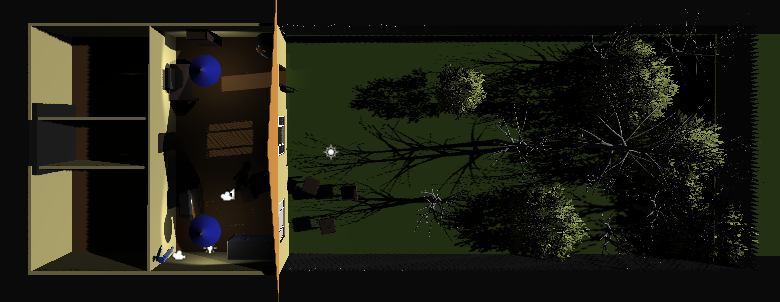
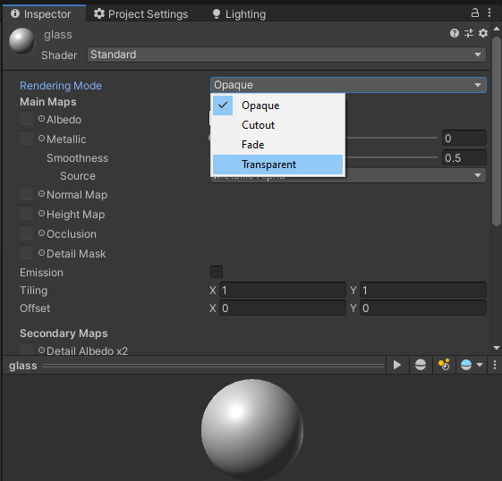
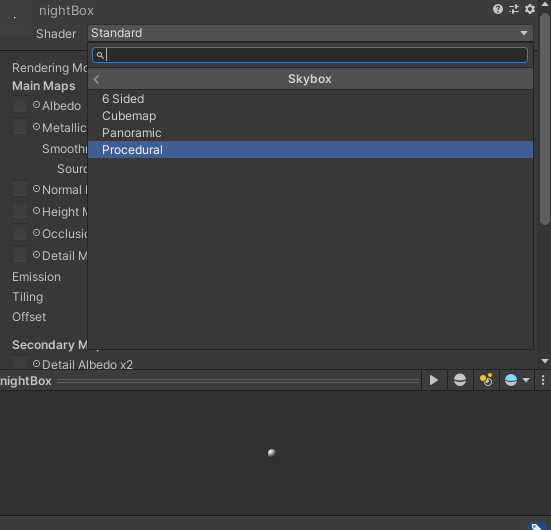

# Unity Advanced 3D Tutorial

 

## 📌 Index

1. [Intro](#intro)
2. [Materials](#materials)
3. [Textures](#Textures)
4. [Effects](#effects)
   * [Fog](#fog)
   * [Rain](#rain) 
   * [Lightning](#lightning)
5. [Interactive Objects](#interactive)
6. [AI](#ai)
7. [Embed 2D Game](#2d)
8. [Odds and Ends](#odds)
   * [Flashlight](#flashlight)

## 1. 👋 Intro

This is a **advanced 3D tutorial**. Hopefully you have seem my previous [Unity 3D tutorial](https://github.com/Zeyu-Li/Unity-Tutorial-3D#unity-user-guide) or are fairly familiar with Unity 3D because I am assuming you are aware of familiar Unity 3D concepts. In addition I will start in a project that has implemented the things in Unity 3D tutorial. The aim of this tutorial is to show the lesser known things in Unity but can be quite useful to know or implement. This tutorial will implement a horror game with a 2D game embed inside the 3D game. 

If you want to follow along, clone from the repo at the [start tag](https://github.com/Zeyu-Li/Unity-Advanced-3D-Tutorial/releases/tag/start) to get the beginning of the project, or skip to whichever selection you want by cloning at the corresponding tag. There you will find a simple project with movement and a scene as shown below

You can start it off and play with it at the start to get a feel of the scene.

\* Note, the lighting is set up right now so you can see the how scene is and can navigate is easily, but the final version will revert back to a darker mood

## 2. 🎨 Materials

Materials in Unity are very simple and can range from a glassy like surface to a flat paint like material

To create your first material:

1. Right click in the project window (preferably in Assets->Materials)

2. Go to Create->Material

3. Name it

4. You have now created your first material!! 🎉 

   Follow the next few steps to get a glass like material

5. Change Rendering Mode to **Transparent**

   

6. Click the white color in the **Albedo** section and change the **Alpha** to 0 for a clear glass look (the closer you are to zero, the clearer the glass)

7. Close the popup

8. Changing the smoothness with impact how reflective the glass is which a number closer to 1 being more reflective and 0 being not at all reflective

Some other options for the materials are:

* Metallic - is a metal or not (please do either 1 or 0 then change the smoothness to effect it because real items are either metallic or not metallic and for better results)
* Normal map - the "baked" map the is actually an illusion for depth (works well if not close by)
* Height map - displacement map for the material (like the normal map but better for close ups)
* Emission - if it emits light or not
* Reflections - if it reflects light to other surfaces

After a material is made, simply drag the material to the object you want applied (can be done to the scene or in the hierarchy). We will apply the glass texture to the second window to the right in the house.

**Skybox**

Next we will do a skybox, although it will actually be a nightbox. Skybox contain your world and is present as the sky in a default new 3D project. For this tutorial, we remake the skybox presently in the scene

1. In materials folder, do another Create->Material

2. Call it nightBox

3. Select the **Shader** and change it to Skybox->Procedural

   

4. Now you can change

   * The sun size
   * Time of day with **Atmosphere Thickness**
   * "**Ground**" color
   * Sky tint

To apply these changes to the current scene:

1. Go to your Lighting window (Window->Rendering->Lightning Setting)

2. Environment->Skybox Material
3. Select the newly created nightBox

## 3. 🧻 Textures

## 4. ✨ Effects

**Fog**

**Rain**

**Lightning**

## 5. 👇 Interactive Objects

## 6. 🤖 AI

## 7. 💻 Embed 2D Game

## 8. 🧶 Odds and Ends

**Flashlight**

## License

 

Music is inspired by [Kano - Another Life](https://www.youtube.com/watch?v=-zQd6xiGAUo&ab_channel=MAXMELIX) and remixed by Torchkas in the [VLDC9 - Abstract](https://www.smwcentral.net/?p=section&a=details&id=14805). Instrumental remake is made by me and I hereby give it the following license

 This work is licensed under a <a rel="license" href="http://creativecommons.org/licenses/by/4.0/">Creative Commons Attribution 4.0 International License</a>.

