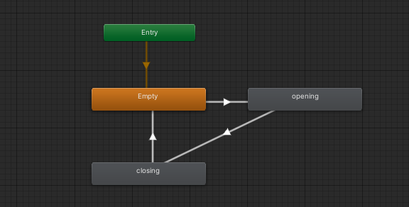
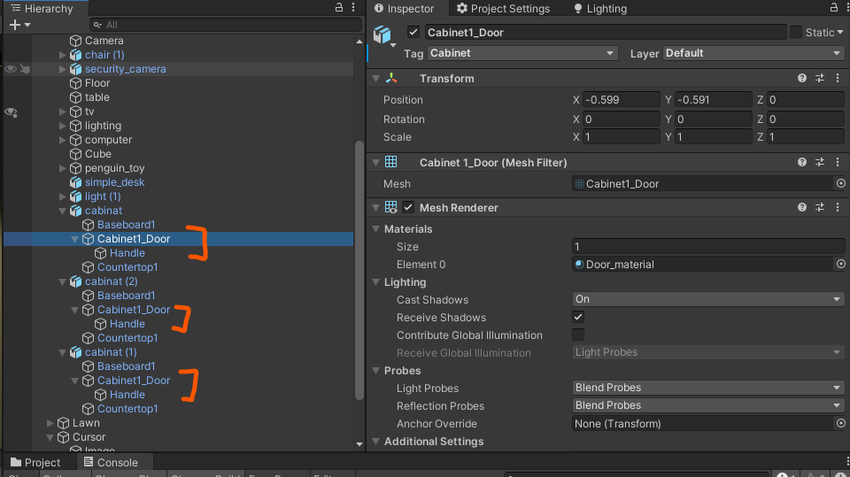

# Unity Advanced 3D Tutorial


[](https://opensource.org/licenses/MIT) 

## 📌 Index

1. [Intro](#intro)
2. [Materials](#materials)
3. [Textures](#Textures)
5. [Interactive Objects](#interactive)
6. [AI](#ai)
7. [Embed 2D Game](#2d)
7. [Effects](#effects)
   * [Fog](#fog)
   * [Rain](#rain) 
   * [Lightning](#lightning)
8. [Odds and Ends](#odds)
   * [Flashlight](#flashlight)

<a name="intro"></a>

## 1. 👋 Intro

This is a **advanced 3D tutorial**. Hopefully you have seem my previous [Unity 3D tutorial](https://github.com/Zeyu-Li/Unity-Tutorial-3D#unity-user-guide) or are fairly familiar with Unity 3D because I am assuming you are aware of familiar Unity 3D concepts. In addition I will start in a project that has implemented the things in Unity 3D tutorial. The aim of this tutorial is to show the lesser known things in Unity but can be quite useful to know or implement. This tutorial will implement a horror game with a 2D game embed inside the 3D game. 

If you want to follow along, clone from the repo at the [start tag](https://github.com/Zeyu-Li/Unity-Advanced-3D-Tutorial/releases/tag/start) to get the beginning of the project, or skip to whichever selection you want by cloning at the corresponding tag. There you will find a simple project with movement and a scene as shown below


You can start it off and play with it at the start to get a feel of the scene.

\* Note, the lighting is set up right now so you can see the how scene is and can navigate is easily, but the final version will revert back to a darker mood

<a name="materials"></a>

## 2. 🎨 Materials

Materials in Unity are very simple and can range from a glassy like surface to a flat paint like material

To create your first material:

1. Right click in the project window (preferably in Assets->Materials)

2. Go to Create->Material

3. Name it

4. You have now created your first material!! 🎉 

   Follow the next few steps to get a glass like material

5. Change Rendering Mode to **Transparent**

   

6. Click the white color in the **Albedo** section and change the **Alpha** to 0 for a clear glass look (the closer you are to zero, the clearer the glass)

7. Close the popup

8. Changing the smoothness with impact how reflective the glass is which a number closer to 1 being more reflective and 0 being not at all reflective

Some other options for the materials are:

* Metallic - is a metal or not (please do either 1 or 0 then change the smoothness to effect it because real items are either metallic or not metallic and for better results)
* Normal map - the "baked" map the is actually an illusion for depth (works well if not close by)
* Height map - displacement map for the material (like the normal map but better for close ups)
* Emission - if it emits light or not
* Reflections - if it reflects light to other surfaces

After a material is made, simply drag the material to the object you want applied (can be done to the scene or in the hierarchy). We will apply the glass texture to the second window to the right in the house.

**Skybox**

Next we will do a skybox, although it will actually be a nightbox. Skybox contain your world and is present as the sky in a default new 3D project. For this tutorial, we remake the skybox presently in the scene

1. In materials folder, do another Create->Material

2. Call it nightBox

3. Select the **Shader** and change it to Skybox->Procedural

   

4. Now you can change

   * The sun size
   * Time of day with **Atmosphere Thickness**
   * "**Ground**" color
   * Sky tint

To apply these changes to the current scene:

1. Go to your Lighting window (Window->Rendering->Lightning Setting)

2. Environment->Skybox Material
3. Select the newly created nightBox

<a name="textures"></a>

## 3. 🧻 Textures

Next we will implement a rendered texture. Think of this as a television screen that broadcasts from a camera live! 

1. Create->Rendered Texture in your texture folder (I named it tv)

2. Change size to 1520x1000

3. Create new material called *tvView*

4. Drag the tv texture to the **Albedo** box (see the green box in the image below)

5. Drag the material onto the object to apply the screen (in my case it will be the brown part of the TV screen)

6. Select the unity camera the captures the action to be rendered (this is the one right bay the blue camera on the top left of the starting position)

7. Go to **Target Texture** and change to the tv

8. If the screen is too dark, enable emissions and drag the tv texture into the Emission's Color box

9. To change the brightness, click on the color box (see red circled)

   

10. The intensity correlates to how much brighter the image is. The color is the tint on the screen

<a name="interactive"></a>

## 4. 👇 Interactive Objects

In this part we will make several changes such that the game is more interactive. This includes opening drawers/doors, picking up objects. In addition we will be starting the embed 2D game with added a screen when you view the screen. 

The first step is opening the cabinet

1. Create a new animation controller

2. Open the animator and add a bool of openCabinet 

3. Right click in the animator tab and do Create State->Empty and name it empty

4. Drag in the open and close cabinet animations

5. Connect the open, close and empty into a triangle of the form Empty->opening->closing (see below)

   

6. Set the Empty->opening transition to openCabinet = true, opening->closing tranisiton to false and double check to see if closing->Empty has the *Has Exit Time* checkbox checked

   Resource: https://www.youtube.com/watch?v=dEpH6-vwxYY

   

   Now we have an animation for opening and closing the cabinet, we need to open the cabinet when we view and click a button. This can be done via recasting from the camera

7. First add the *eToOpen* sprite to the scene (probably above the cursor) and disable it for now

8. Create an empty SelectionManager that houses the script for toggling the selection

9. In the script do

   ```c#
   using System.Collections;
   using System.Collections.Generic;
   using UnityEngine;
   
   public class select : MonoBehaviour
   {
       RaycastHit hit;
       public GameObject UIDisplay;
       public string cabinetTag = "Cabinet";
       public float maxDistance = 2.0f;
   
       void Update()
       {
           var ray = Camera.main.ScreenPointToRay(Input.mousePosition);
           var cameraTransform = Camera.main.GetComponent<Transform>();
           Debug.DrawRay(cameraTransform.position, cameraTransform.forward * maxDistance, Color.green);
           if (Physics.Raycast(ray, out RaycastHit hit, maxDistance)) {
               Transform selection = hit.transform;
   
               if (selection.CompareTag(cabinetTag)) {
                   var selectionRenderer = selection.GetComponent<Renderer>();
   
                   if (selectionRenderer != null) {
                       // show UI element
                       UIDisplay.SetActive(true);
                   }
               } else {
                   UIDisplay.SetActive(false);
               }
           }
       }
   }
   ```

10. Create a `Cabinet` layer and added the Cabinet layer to the three cabinets door and handle components (see below)

    

11. Now you can preview the feature and should see that it works

12. Now we want to add checks for when the user presses E and such that it opens

13. 

Now we can open the cabinet, we can do something similar to above with the screen and the password note

1. Drag in passcode png (onto a cube with the right dimensions (try 0.3x0.637)) into the scene and move the to the tree in the back and make sure it's not within the back block/cube (in Lawn->*Block (from back)*), otherwise change the back block to not be intercepting

2. The script we use to do the action can be the same one as the previous one

3. To make the popup for the passcode note, do a new hidden UI image object that is the same as the passcode we dragged in during step 1

4. Now change the script to the following (OR you can drag in another script and change the values there, but there maybe performance hits)

   ```c#
   using System.Collections;
   using System.Collections.Generic;
   using UnityEngine;
   
   public class select : MonoBehaviour
   {
       RaycastHit hit;
       public GameObject UIDisplay;
       public GameObject UINoteDisplay;
       public string cabinetTag = "Cabinet";
       public string noteTag = "Note";
       public float maxDistance = 2.0f;
   
       void Update()
       {
           var ray = Camera.main.ScreenPointToRay(Input.mousePosition);
           var cameraTransform = Camera.main.GetComponent<Transform>();
           Debug.DrawRay(cameraTransform.position, cameraTransform.forward * maxDistance, Color.green);
           if (Physics.Raycast(ray, out RaycastHit hit, maxDistance)) {
               Transform selection = hit.transform;
   
               if (selection.CompareTag(cabinetTag)) {
                   var selectionRenderer = selection.GetComponent<Renderer>();
   
                   if (selectionRenderer != null) {
                       // show UI element
                       UIDisplay.SetActive(true);
                   }
               } else if (selection.CompareTag(noteTag)) {
                   var selectionRenderer = selection.GetComponent<Renderer>();
                   if (selectionRenderer != null) {
                       UINoteDisplay.SetActive(true);
                   }
               } else {
                   UIDisplay.SetActive(false);
                   UINoteDisplay.SetActive(false);
               }
           }
       }
   }
   ```

5. Now you may want to added a fade in fade out and that can be done if you follow this [tutorial](https://www.youtube.com/watch?v=92Fz3BjjPL8), but since this is a scary game, no transitions will be needed 😈

Resource: https://www.youtube.com/watch?v=_yf5vzZ2sYE


<a name="ai"></a>

## 5. 🤖 AI

<!--- This section will begin implementation of some simple AI. This AI will follow --->

<a name="2d"></a>

## 6. 💻 Embed 2D Game


<a name="effects"></a>

## 7. ✨ Effects

<a name="fog"></a>

**Fog**


<a name="rain"></a>

**Rain**


<a name="lightning"></a>

**Lightning**


<a name="odds"></a>

## 8. 🧶 Odds and Ends

<a name="flashlight"></a>

**Flashlight**


## License

[](https://opensource.org/licenses/MIT) 

Music is inspired by [Kano - Another Life](https://www.youtube.com/watch?v=-zQd6xiGAUo&ab_channel=MAXMELIX) and remixed by Torchkas in the [VLDC9 - Abstract](https://www.smwcentral.net/?p=section&a=details&id=14805). Instrumental remake is made by me and I hereby give it the following license

<a rel="license" href="http://creativecommons.org/licenses/by/4.0/"></a><br />This work is licensed under a <a rel="license" href="http://creativecommons.org/licenses/by/4.0/">Creative Commons Attribution 4.0 International License</a>.

