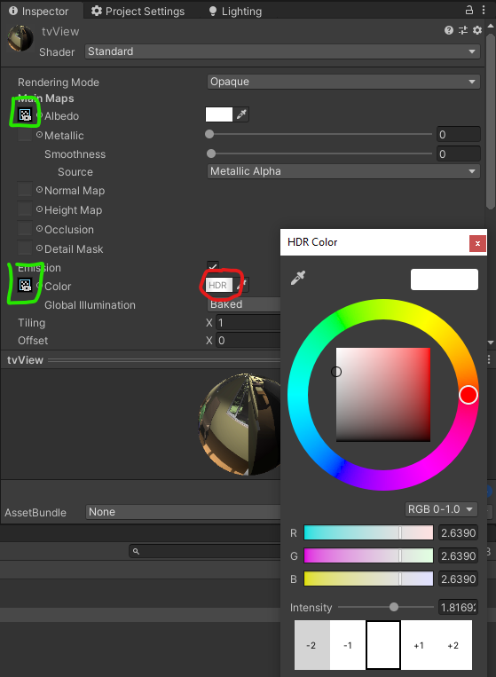
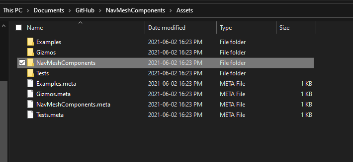
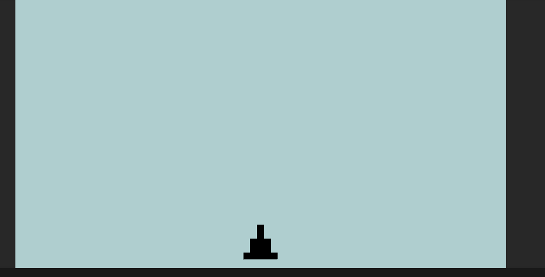
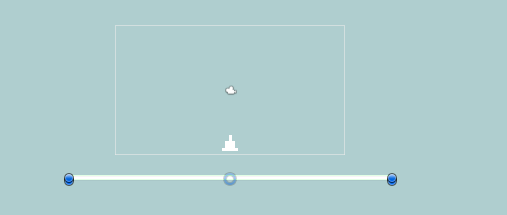
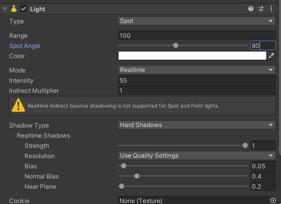
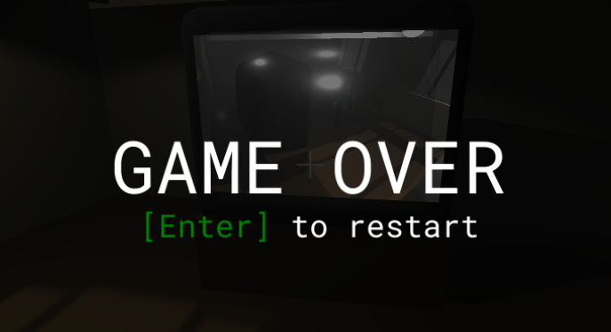

# Unity Advanced 3D Tutorial


[](https://opensource.org/licenses/MIT) 

<a name="top"></a>

## 📌 Index

0. [Demo](#demo)
1. [Intro](#intro)
2. [Materials](#materials)
3. [Textures](#Textures)
4. [Interactive Objects](#interactive)
5. [AI](#ai)
6. [Embed 2D Game](#2d)
7. [Effects](#effects)
   * [Rain](#rain) 
   * [Lightning](#lightning)
   * [Text Typing](#typing)
   * [Game Over Screen](#gameover)
   * [Fog](#fog)
8. [Odds and Ends](#odds)
   * [Flashlight](#flashlight)
   * [Title Screen](#titleScreen)
   * [End Notes](#endNotes)

<a name="demo"></a>

## 0. Demo

<a name="intro"></a>

## 1. 👋 Intro

This is a **advanced 3D tutorial**. Hopefully you have seem my previous [Unity 3D tutorial](https://github.com/Zeyu-Li/Unity-Tutorial-3D#unity-user-guide) or are fairly familiar with Unity 3D because I am assuming you are aware of familiar Unity 3D concepts. In addition I will start in a project that has implemented the things in Unity 3D tutorial. The aim of this tutorial is to show the lesser known things in Unity but can be quite useful to know or implement. This tutorial will implement a horror game with a 2D game embed inside the 3D game. 

If you want to follow along, clone from the repo at the [start tag](https://github.com/Zeyu-Li/Unity-Advanced-3D-Tutorial/releases/tag/start) to get the beginning of the project, or skip to whichever selection you want by cloning at the corresponding tag. There you will find a simple project with movement and a scene as shown below


You can start it off and play with it at the start to get a feel of the scene.

\* Note, the lighting is set up right now so you can see the how scene is and can navigate is easily, but the final version will revert back to a darker mood

<a name="materials"></a>

## 2. 🎨 Materials

Materials in Unity are very simple and can range from a glassy like surface to a flat paint like material

To create your first material:

1. Right click in the project window (preferably in Assets->Materials)

2. Go to Create->Material

3. Name it

4. You have now created your first material!! 🎉 

   Follow the next few steps to get a glass like material

5. Change Rendering Mode to **Transparent**

   

6. Click the white color in the **Albedo** section and change the **Alpha** to 0 for a clear glass look (the closer you are to zero, the clearer the glass)

7. Close the popup

8. Changing the smoothness with impact how reflective the glass is which a number closer to 1 being more reflective and 0 being not at all reflective

Some other options for the materials are:

* Metallic - is a metal or not (please do either 1 or 0 then change the smoothness to effect it because real items are either metallic or not metallic and for better results)
* Normal map - the "baked" map the is actually an illusion for depth (works well if not close by)
* Height map - displacement map for the material (like the normal map but better for close ups)
* Emission - if it emits light or not
* Reflections - if it reflects light to other surfaces

After a material is made, simply drag the material to the object you want applied (can be done to the scene or in the hierarchy). We will apply the glass texture to the second window to the right in the house.

**Skybox**

Next we will do a skybox, although it will actually be a nightbox. Skybox contain your world and is present as the sky in a default new 3D project. For this tutorial, we remake the skybox presently in the scene

1. In materials folder, do another Create->Material

2. Call it nightBox

3. Select the **Shader** and change it to Skybox->Procedural

   

4. Now you can change

   * The sun size
   * Time of day with **Atmosphere Thickness**
   * "**Ground**" color
   * Sky tint

To apply these changes to the current scene:

1. Go to your Lighting window (Window->Rendering->Lightning Setting)

2. Environment->Skybox Material
3. Select the newly created nightBox

<a name="textures"></a>

## 3. 🧻 Textures

Next we will implement a rendered texture. Think of this as a television screen that broadcasts from a camera live! 

1. Create->Rendered Texture in your texture folder (I named it tv)

2. Change size to 1520x1000

3. Create new material called *tvView*

4. Drag the tv texture to the **Albedo** box (see the green box in the image below)

5. Drag the material onto the object to apply the screen (in my case it will be the brown part of the TV screen)

6. Select the unity camera the captures the action to be rendered (this is the one right bay the blue camera on the top left of the starting position)

7. Go to **Target Texture** and change to the tv

8. If the screen is too dark, enable emissions and drag the tv texture into the Emission's Color box

9. To change the brightness, click on the color box (see red circled)

   

10. The intensity correlates to how much brighter the image is. The color is the tint on the screen

<a name="interactive"></a>

## 4. 👇 Interactive Objects

In this part we will make several changes such that the game is more interactive. This includes opening drawers/doors, picking up objects. In addition we will be starting the embed 2D game with added a screen when you view the screen. 

The first step is opening the cabinet

1. Create a new animation controller

2. Open the animator and add a bool of openCabinet 

3. Right click in the animator tab and do Create State->Empty and name it empty

4. Drag in the open and close cabinet animations

5. Connect the open, close and empty into a triangle of the form Empty->opening->closing (see below)

   

6. Set the Empty->opening transition to openCabinet = true, opening->closing tranisiton to false and double check to see if closing->Empty has the *Has Exit Time* checkbox checked

   Resource: https://www.youtube.com/watch?v=dEpH6-vwxYY

   

   Now we have an animation for opening and closing the cabinet, we need to open the cabinet when we view and click a button. This can be done via recasting from the camera

7. First add the *eToOpen* sprite to the scene (probably above the cursor) and disable it for now

8. Create an empty SelectionManager that houses the script for toggling the selection

9. In the script do

   ```c#
   using System.Collections;
   using System.Collections.Generic;
   using UnityEngine;
   
   public class select : MonoBehaviour
   {
       RaycastHit hit;
       public GameObject UIDisplay;
       public string cabinetTag = "Cabinet";
       public float maxDistance = 2.0f;
   
       void Update()
       {
           var ray = Camera.main.ScreenPointToRay(Input.mousePosition);
           var cameraTransform = Camera.main.GetComponent<Transform>();
           Debug.DrawRay(cameraTransform.position, cameraTransform.forward * maxDistance, Color.green);
           if (Physics.Raycast(ray, out RaycastHit hit, maxDistance)) {
               Transform selection = hit.transform;
   
               if (selection.CompareTag(cabinetTag)) {
                   var selectionRenderer = selection.GetComponent<Renderer>();
   
                   if (selectionRenderer != null) {
                       // show UI element
                       UIDisplay.SetActive(true);
                   }
               } else {
                   UIDisplay.SetActive(false);
               }
           }
       }
   }
   ```

10. Create a `Cabinet` layer and added the Cabinet layer to the three cabinets door and handle components (see below)

    

11. Now you can preview the feature and should see that it works

12. Now we want to add checks for when the user presses E and such that it opens

13. If we want to trigger the animate with `e` key, update select to the follow:

    ```c#
    using System.Collections;
    using System.Collections.Generic;
    using UnityEngine;
    
    public class selectCabinet : MonoBehaviour
    {
        RaycastHit hit;
        public GameObject UIDisplay;
        public string cabinetTag = "Cabinet";
        public float maxDistance = 2.0f;
    
        void Update()
        {
            var ray = Camera.main.ScreenPointToRay(Input.mousePosition);
            var cameraTransform = Camera.main.GetComponent<Transform>();
            // Debug.DrawRay(cameraTransform.position, cameraTransform.forward * maxDistance, Color.green);
            if (Physics.Raycast(ray, out RaycastHit hit, maxDistance)) {
                Transform selection = hit.transform;
    
                if (selection.CompareTag(cabinetTag)) {
                    var selectionRenderer = selection.GetComponent<Renderer>();
    
                    if (selectionRenderer != null) {
                        if (Input.GetKeyDown(KeyCode.E)) {
                            // get selection
                            var sectionAnimator = selection.parent;
                            // animate cabinet
                            sectionAnimator.GetComponent<Animator>().SetBool("openCabinet", true);
                            // set tag to opened cabinet
                            selectionRenderer.gameObject.tag = "OpenCabinet";
                        } else {
                            // show UI element
                            UIDisplay.SetActive(true);
                        }
                    }
                } else {
                    UIDisplay.SetActive(false);
                }
            } else {
                UIDisplay.SetActive(false);
            }
        }
    }
    ```

14. Make sure you attach the animator component to the main model (see the red marker below) then tag only the door part of the model

    

\** Make sure the object you are applying the raycast to has a collider!!

Now we can open the cabinet, we can do something similar to above with the screen and the password note

1. Drag in passcode png (onto a cube with the right dimensions (try 0.3x0.637)) into the scene and move the to the tree in the back and make sure it's not within the back block/cube (in Lawn->*Block (from back)*), otherwise change the back block to not be intercepting

2. The script we use to do the action can be the same one as the previous one

3. To make the popup for the passcode note, do a new hidden UI image object that is the same as the passcode we dragged in during step 1

4. Now change the script to the following (OR you can drag in another script and change the values there, but there maybe performance hits)

   ```c#
   using System.Collections;
   using System.Collections.Generic;
   using UnityEngine;
   
   public class select : MonoBehaviour
   {
       RaycastHit hit;
       public GameObject UIDisplay;
       public GameObject UINoteDisplay;
       public string cabinetTag = "Cabinet";
       public string noteTag = "Note";
       public float maxDistance = 2.0f;
   
       void Update()
       {
           var ray = Camera.main.ScreenPointToRay(Input.mousePosition);
           var cameraTransform = Camera.main.GetComponent<Transform>();
           Debug.DrawRay(cameraTransform.position, cameraTransform.forward * maxDistance, Color.green);
           if (Physics.Raycast(ray, out RaycastHit hit, maxDistance)) {
               Transform selection = hit.transform;
   
               if (selection.CompareTag(cabinetTag)) {
                   var selectionRenderer = selection.GetComponent<Renderer>();
   
                   if (selectionRenderer != null) {
                       // show UI element
                       UIDisplay.SetActive(true);
                   }
               } else if (selection.CompareTag(noteTag)) {
                   var selectionRenderer = selection.GetComponent<Renderer>();
                   if (selectionRenderer != null) {
                       UINoteDisplay.SetActive(true);
                   }
               } else {
                   UIDisplay.SetActive(false);
                   UINoteDisplay.SetActive(false);
               }
           }
       }
   }
   ```

5. Now you may want to added a fade in fade out and that can be done if you follow this [tutorial](https://www.youtube.com/watch?v=92Fz3BjjPL8), but since this is a scary game, no transitions will be needed 😈

We can do the same thing with the computer screen but show a different animated screen for that

To see how you do a video in Unity, use this tutorial: https://www.youtube.com/watch?v=p7iXEZGx2Mc

Resource: https://www.youtube.com/watch?v=_yf5vzZ2sYE


<a name="ai"></a>

## 5. 🤖 AI

This section will begin implementation of some simple AI. This AI will follow the player if it is outside. 

1. Drag in the ghost model into the lawn (or just start in start-AI tag) into a empty object

2. Add a *Nav Mesh Agent* to the ghost's parent (empty)

3. Change the options for the Nav Mesh Agent
   * Most of the options are obvious but here are some non obvious ones
   * Base offset (collision base offset)
   * Acceleration - How fast the AI accelerates
   
4. Add a capsule collider to the top parent along with a rigid body. Set the collider to be about the same as the nav mesh and the rigid body has *Is Kinematic* checked

5. Add the [NavMeshComponents](https://github.com/Unity-Technologies/NavMeshComponents) into the project

   1. Go to the link and clone the repo

   2. Copy the NavMesComponents (in Assets) into the project file

      

6. Create a new empty gameobject and drag in the *NavMeshSurface*

7. Include the necessary layers and click bake to get the generated surface that the AI can walk on

8. Create a new AI script

9. Paste in the following script

   ```c#
   using System.Collections;
   using System.Collections.Generic;
   using UnityEngine;
   using UnityEngine.AI;
   
   public class ghostAI : MonoBehaviour
   {
       public float lookRadius = 10f;
       public float timeBetweenAttacks = 2f;
       public Vector3 walkPoint;
       bool walkPointSet;
   
       Transform target;
       public NavMeshAgent ghost;
   
       public GameObject player;
       public Vector3 distanceToPatrolPoint ;
   
       // Start is called before the first frame update
       void Start()
       {
           target = player.transform;
       }
   
       // Update is called once per frame
       void Update()
       {
           float distance = Vector3.Distance(target.position, transform.position);
   
           if (distance < lookRadius) {
               ghost.SetDestination(target.position);
               // face target when aggro
               FaceTarget();
           } else {
               // if outside range, patrol
               Patrol();
           }
       }
   
       void FaceTarget() {
           Vector3 direction = (target.position - transform.position).normalized;
           Quaternion lookRotation = Quaternion.LookRotation(new Vector3(direction.x, 0, direction.z));
           transform.rotation = Quaternion.Slerp(transform.rotation, lookRotation, Time.deltaTime * 5f);
       }
   
       /**
       * draws debug sphere for sight
       */
       void OnDrawGizmos() {
           Gizmos.color = Color.red;
           Gizmos.DrawWireSphere(transform.position, lookRadius);
       }
   
       private void Patrol() {
           // 
           if (!walkPointSet) {
               SearchWalkPoint();
           }
           if (walkPointSet) {
               ghost.SetDestination(walkPoint);
           }
   
           distanceToPatrolPoint = transform.position - walkPoint;
   
           if (distanceToPatrolPoint.magnitude < 4f) {
               walkPointSet = false;
           }
       }
       private void SearchWalkPoint() {
           // search for suitable random place to walk to
           float randomZ = Random.Range(-lookRadius, lookRadius);
           float randomX = Random.Range(-lookRadius, lookRadius);
   
           RaycastHit hit;
   
           walkPoint = new Vector3(transform.position.x + randomX, transform.position.y, transform.position.z + randomZ);
   
           if (Physics.Raycast(walkPoint, -transform.up, out hit, 2f) && hit.transform.tag == "Lawn") {
               walkPointSet = true;
           }
       }
   }
   ```

10. Make sure you have the lawn saved to the lawn layer

11. Now we need to set the attack for the enemy

12. For this tutorial, the player only has 1 life so after they get attacked, the player is forced to restart

13. For this we will be using something similar to the pause menu in the first 3D tutorial since we want to pause after hit and to restart the level

14. See the [Game Over](#gameover) section to find out how to set up the game over UI screen, otherwise update the script with the following

    ```c#
    using System.Collections;
    using System.Collections.Generic;
    using UnityEngine;
    using UnityEngine.AI;
    
    public class ghostAI : MonoBehaviour
    {
        public float lookRadius = 10f;
        public float attackRadius = 1f;
        public float timeBetweenAttacks = 2f;
        public Vector3 walkPoint;
        bool walkPointSet;
    
        Transform target;
        public NavMeshAgent ghost;
    
        public GameObject player;
        public GameObject killScreen;
        private Vector3 distanceToPatrolPoint;
    
        // Start is called before the first frame update
        void Start()
        {
            target = player.transform;
        }
    
        // Update is called once per frame
        void Update()
        {
            float distance = Vector3.Distance(target.position, transform.position);
    
            if (distance < attackRadius) {
                // kill player 
                killScreen.SetActive(true);
                Time.timeScale = 0f;
            } else if (distance < lookRadius) {
                ghost.SetDestination(target.position);
                // face target when aggro
                FaceTarget();
            } else {
                // if outside range, patrol
                Patrol();
            }
        }
    
        void FaceTarget() {
            Vector3 direction = (target.position - transform.position).normalized;
            Quaternion lookRotation = Quaternion.LookRotation(new Vector3(direction.x, 0, direction.z));
            transform.rotation = Quaternion.Slerp(transform.rotation, lookRotation, Time.deltaTime * 5f);
        }
    
        /**
        * draws debug sphere for sight
        */
        void OnDrawGizmos() {
            Gizmos.color = Color.green;
            Gizmos.DrawWireSphere(transform.position, lookRadius);
            Gizmos.color = Color.red;
            Gizmos.DrawWireSphere(transform.position, attackRadius);
        }
    
        private void Patrol() {
            // 
            if (!walkPointSet) {
                SearchWalkPoint();
            }
            if (walkPointSet) {
                ghost.SetDestination(walkPoint);
            }
    
            distanceToPatrolPoint = transform.position - walkPoint;
    
            if (distanceToPatrolPoint.magnitude < 4f) {
                walkPointSet = false;
            }
        }
        private void SearchWalkPoint() {
            // search for suitable random place to walk to
            float randomZ = Random.Range(-lookRadius, lookRadius);
            float randomX = Random.Range(-lookRadius, lookRadius);
    
            RaycastHit hit;
    
            walkPoint = new Vector3(transform.position.x + randomX, transform.position.y, transform.position.z + randomZ);
    
            if (Physics.Raycast(walkPoint, -transform.up, out hit, 2f) && hit.transform.tag == "Lawn") {
                walkPointSet = true;
            }
        }
    }
    ```

15. Add the kill screen UI as the gameover screen

Resource: https://www.youtube.com/watch?v=UjkSFoLxesw


<a name="2d"></a>

## 6. 💻 Embed 2D Game

In the next part we will make an embed 2D game within the 3D environment. This could easy be done with loading into a new scene although we must keep track of settings in the previous scene as they are not saved between scenes. In this part we will create a code terminal that will ask the user for a password. If they get it right, then they will we be brought to a simple 2D shooter to be completed and will result in an end condition for completing the game

1. Create a new Scene called 2D and start the scene

2. Make a background for the terminal (black Panel + scaled just a touch above 1 so it doesn't have the edge bleed)

3. Do these steps above or start at [2D start](https://github.com/Zeyu-Li/Unity-Advanced-3D-Tutorial/tree/2D-start)

4. Watch this series on making a working Terminal: [youtube.com/watch?v=qpvtTb1a9NQ&list=PLf9ofW-QospneJkI2HzX_OzTJavvZkItm](https://www.youtube.com/watch?v=qpvtTb1a9NQ&list=PLf9ofW-QospneJkI2HzX_OzTJavvZkItm)

5. Obviously the commands are different and the following are the commands:

   ```c#
   using System;
   using System.Text;
   using System.Collections;
   using System.Collections.Generic;
   using UnityEngine;
   using UnityEngine.SceneManagement;
   
   public class Interpreter : MonoBehaviour
   {
       public GameObject shooterGame;
       public GameObject terminalUI;
       List<string> response = new List<string>();
   
       public List<string> Interpret(string userInput) {
           response.Clear();
   
           // split
           string[] args = userInput.Trim().Split();
   
           if (args[0] == "help") {
               response.Add("A list of commands are listed below");
               response.Add("<color=#22A421>help</color> - a list of commands");
               response.Add("<color=#22A421>decode </color><color=#cf08c8>args</color> - decodes the");
               response.Add("message args (case sensitive)");
               response.Add("<color=#22A421>password</color> <color=#cf08c8>args</color> - enter the password as args");
               response.Add("<color=#22A421>exit</color> - exit shell environment");
   
               return response;
           } else if (args[0] == "exit") {
               // load back to other scene
               response.Add("exiting...");
               SceneManager.LoadScene("Main");
   
               return response;
           } else if (args[0] == "password") {
               // check password
               try {
                   if (args[1] != "666") {
                       response.Add("<color=#FF0000>The password you entered is incorrect</color>");
                       response.Add("please try again");
                       
                       return response;
                   }
                   // enter 2D shooter
                   response.Add("virtualizing...");
   
                   shooterGame.SetActive(true);
                   terminalUI.SetActive(false);
   
                   return response;
               } catch {
                   response.Add("You did not provide a password");
                   response.Add("Please use the <color=#22A421>help</color> command if you want a refresher");
                   
                   return response;
               }
           } else if (args[0] == "decode") {
               // decode message
               try {
                   string decodedText = Encoding.UTF8.GetString(Convert.FromBase64String(args[1]));
                   response.Add(decodedText);
                   
                   return response;
               } catch (IndexOutOfRangeException) {
                   response.Add("You did not provide an argument to decode");
                   response.Add("Please use the <color=#22A421>help</color> command if you want a refresher");
                   
                   return response;
               } catch {
                   response.Add("Could not decode properly, try again :(");
                   
                   return response;
               }
           } else if (args[0] == "whoami") {
                   response.Add("Consumed by darkness and tormented by light");
                   response.Add("you are the one prophesied");
                   
                   return response;
           } else {
               response.Add("This command is unknown");
               response.Add("use <color=#22A421>help</color> to find a list of all the usuable commands");
   
               return response;
           }
       }
   }
   ```

Resource: https://www.youtube.com/watch?v=tCWTJLsxFhw

Now we can start doing the simple 2D shooter, which will be very simple pixel art. 

1. Gather the resources and sprites (just the ship)

2. Drag in the ship (and have a background) and scale it such that it looks something like this:

   

3. Now we want the ship to follow the mouse so make a new script on the ship and paste in the following

   ```c#
   using System.Collections;
   using System.Collections.Generic;
   using UnityEngine;
   
   public class lookToMouse : MonoBehaviour
   {
       // from https://answers.unity.com/questions/855976/make-a-player-model-rotate-towards-mouse-location.html
       // Update is called once per frame
       void Update() {
           
           //Get the Screen positions of the object
           Vector2 positionOnScreen = Camera.main.WorldToViewportPoint(transform.position);
           
           //Get the Screen position of the mouse
           Vector2 mouseOnScreen = (Vector2)Camera.main.ScreenToViewportPoint(Input.mousePosition);
           
           //Get the angle between the points
           float angle = AngleBetweenTwoPoints(positionOnScreen, mouseOnScreen);
   
           //Ta Daaa
           transform.rotation =  Quaternion.Euler(new Vector3(0f,0f,angle+90));
       }
   
       float AngleBetweenTwoPoints(Vector3 a, Vector3 b) {
           return Mathf.Atan2(a.y - b.y, a.x - b.x) * Mathf.Rad2Deg;
       }
   }
   ```

4. Now we want to shot projectiles so make a block of a good size and add a 2D box collider (on trigger)

5. We also need to do the same with the enemy (also add a rigid body 2D)

6. We want to add a script to destroy the projectile and the enemy on collision. This is very simple and only requires 4 lines of code but also we want to delete the bullet after a certain amount of seconds such that there is no performance hit from too many bullets (very unlikely to happen with 2D objects but is best practice)

   ```c#
   using System.Collections;
   using System.Collections.Generic;
   using UnityEngine;
   
   public class destroyEnemy : MonoBehaviour
   {
       private void Start() {
           // destroys object after 3 seconds
           Destroy(gameObject, 3);
       }
   
       private void OnTriggerEnter2D(Collider2D collision) {
           if (collision.gameObject.CompareTag("EnemyShip")) {        
               Destroy(collision.gameObject);   
               // destroy self 
               Destroy(gameObject);
           }
       }
   }
   ```

7. Create prefabs for the enemy ship and projectile

8. Now we want to spawn a new instance of a bullet on click (this can be done in the *lookToMouse* script in step 3)

   ```c#
   using System.Collections;
   using System.Collections.Generic;
   using UnityEngine;
   
   public class lookToMouse : MonoBehaviour
   {
       // audio    
       public AudioSource audioSource;
       public AudioClip shootingSound;
       public float volume = 0.2f; // volume
       public float bulletSpeed = 20f; 
   
       private Vector2 shootDir;
   
       // from https://answers.unity.com/questions/855976/make-a-player-model-rotate-towards-mouse-location.html
       // Update is called once per frame
       void Update() {
           // Get the Screen positions of the object
           Vector2 positionOnScreen = Camera.main.WorldToViewportPoint(transform.position);
           
           // Get the Screen position of the mouse
           Vector2 mouseOnScreen = (Vector2)Camera.main.ScreenToViewportPoint(Input.mousePosition);
           
           // Get the angle between the points
           float angle = AngleBetweenTwoPoints(positionOnScreen, mouseOnScreen);
           Quaternion unityAngle = Quaternion.Euler(new Vector3(0f,0f,angle+90));
   
           if (Input.GetButtonDown("Fire1")) {
               // create new object
               GameObject bullet = (GameObject)Instantiate(Resources.Load("Prefabs/playerProjectile"));
               // to play sound
               audioSource.PlayOneShot(shootingSound, volume);
               bullet.transform.position = transform.position;
               bullet.transform.rotation = unityAngle;
   
               bullet.GetComponent<Rigidbody2D>().AddForce(transform.up * bulletSpeed, ForceMode2D.Impulse);
           }
   
           // set rotation of ship
           transform.rotation = unityAngle;
       }
   
       float AngleBetweenTwoPoints(Vector3 a, Vector3 b) {
           return Mathf.Atan2(a.y - b.y, a.x - b.x) * Mathf.Rad2Deg;
       }
   }
   ```

9. Make sure you have a **Resources/Prefabs** in the project with the *playerProjectile* so the instance can be instantiated

10. Now it should generally work however there is no sound

11. Gather the sound files (I used https://sfbgames.itch.io/chiptone to generate my sounds)

12. Use the following to play sounds once:

13. ```c#
    // audio    
    public AudioSource audioSource;
    public AudioClip clip;
    public float volume = 0.2f; // volume
    
    // to play sound
    audioSource.PlayOneShot(clip, volume);
    ```

14. Now we can program in the descending enemies. These will be positioned randomly and last only 30 seconds in total. Once the player has defeated them all before they enter the bottom of the screen, we win, otherwise the player will have to try again

15. Create a win UI that will show when you win

16. Add the following to the ship and tune the height and x range to your liking

    ```c#
    using System.Collections;
    using System.Collections.Generic;
    using UnityEngine;
    
    public class spawnEnemy : MonoBehaviour
    {
        public float time = 30f;
        public int shipsCount = 27;
        [Header("The randomness in the x postion when spawn")]
        public float x = 5f;
        
        [Header("Height of screen")]
        public float y = 10f;
    
        public GameObject endScreen;
    
        private bool spawned = false;
    
    
        void Start()
        {
            StartCoroutine("Spawn");
        }
    
        public void restart() {
            StopCoroutine("Spawn");
            StartCoroutine("Spawn");
        }
    
        void Update() {
            // this check is squeezed till one is greater than the other (2.5 seconds for the last one to travel across the screen)
            if (spawned) {
                // show end message
                endScreen.SetActive(true);
            }
        }
    
        // Update is called once per frame
        IEnumerator Spawn() {
            for (int i = 0; i < shipsCount; i++) {
                // spawn enemy ship
                float randomX = Random.Range(-x, x);
    
                float spawnX = transform.position.x + randomX; 
                float spawnY = transform.position.y + y;
    
                // create new object
                GameObject enemyShip = (GameObject)Instantiate(Resources.Load("Prefabs/enemy"));
                enemyShip.transform.position = new Vector3(spawnX, spawnY, transform.position.z);
                
                // destroys object after 3 seconds
                Destroy(enemyShip, 3);
    
                // randomness
                if (i == shipsCount - 1) spawned = true;
                yield return new WaitForSeconds(time/shipsCount + Random.Range(-1 * (time/shipsCount) * 0.5f, 0));
            }
        }
    }
    ```

17. Now you should be able to play the game except there is no fail condition

18. Drag in a block (sprite) with a 2D box collider (is trigger) that resides under the main screen like so:

    

19. Now we add a script to fail once an enemy ship collides with the block

    ```c#
    using System.Collections;
    using System.Collections.Generic;
    using UnityEngine;
    
    public class loseCondition : MonoBehaviour
    {
        public GameObject loseUI;
        // audio    
        public AudioSource audioSource;
        public AudioClip dies;
        public float volume = 0.2f; // volume
    
        void Start()
        {
            
        }
    
        // Update is called once per frame
    
        private void OnTriggerEnter2D(Collider2D collision) {
            if (collision.gameObject.CompareTag("EnemyShip")) {        
                Destroy(collision.gameObject);   
                // opens restart UI
                loseUI.SetActive(true);
                loseUI.GetComponent<restartShooter>().end();
                // to play sound
                audioSource.PlayOneShot(dies, volume);
            }
        }
    }
    ```

20. We also want to set is such that the player can reset when they lose. This can be done with the following on the lose UI (similar to the win UI)

    ```c#
    using System.Collections;
    using System.Collections.Generic;
    using UnityEngine;
    
    public class restartShooter : MonoBehaviour
    {
        public GameObject ship;
        public GameObject self;
    
        public void end() {
            ship.SetActive(false);
            Time.timeScale = 0f;
        }
    
        void Update()
        {
            if (Input.GetKeyDown(KeyCode.Return)) {
                // refresh
                ship.SetActive(true);
                Time.timeScale = 1f;
                ship.GetComponent<spawnEnemy>().restart();
    
                self.SetActive(false);
            }
        }
    }
    ```

Let's not forget about transitioning from the main view to the shell view. This can be done with a simple scene load when the player presses `space` on shell video screen

1. Added directions to enter the shell environment in the shell video (under the video raw so it will show when the video shows) 

2. Add a script that defines this behaviour under the directions 

   ```c#
   using System.Collections;
   using System.Collections.Generic;
   using UnityEngine;
   using UnityEngine.SceneManagement;
   
   public class enterToNewScene : MonoBehaviour
   {
       void Update()
       {
           if (Input.GetKeyDown(KeyCode.Return)) {
               SceneManager.LoadScene("2D", LoadSceneMode.Additive);
           }
       }
   }
   ```

3. You also want scripts to hide and show cursors:

   ```c#
   using System.Collections;
   using System.Collections.Generic;
   using UnityEngine;
   
   public class showCursor : MonoBehaviour
   {
       // Start is called before the first frame update
       void Start()
       {
           // change to false if not wanting to show cursor and remove the lock state line
           Cursor.lockState = CursorLockMode.None;
           Cursor.visible = true;
       }
   }
   ```


Otherwise there are still some steps on linking up the terminal, the game, and a few other things, but that is left to you to figure out and play with


<a name="effects"></a>

## 7. ✨ Effects

<a name="rain"></a>

**Rain**

See this [YouTube video](#https://youtu.be/Ph3FvxJJ8AA?t=246) starting at 4:06


<a name="lightning"></a>

**Lightning**

Next we want some lightning to compliment the rain. 

1. Create a spot light that illuniates the whole scene

2. It should have settings similar to the following

   

3. The light should make the scene really bright and have a color fade effect

4. Now we want to add a script to it to flash every so often for a set amount of time

   ```c#
   using System.Collections;
   using System.Collections.Generic;
   using UnityEngine;
   
   public class lightning : MonoBehaviour
   {
       public Light lightningLight;
       public float minFlickerTime = 0.1f;
       public float maxFlickerTime = 0.4f;
   
       void Start() {
           lightningLight = GetComponent<Light>();
           lightningLight.enabled = false;
           StartCoroutine("Flicker");
       }
   
       IEnumerator Flicker() {
           while (true) {
               yield return new WaitForSeconds(Random.Range(0.4f, 3f));
               lightningLight.enabled = true;
               yield return new WaitForSeconds(Random.Range(minFlickerTime, maxFlickerTime));
               lightningLight.enabled = false;
           }
       }
   }
   ```
   
5. Remember to attach the lights onto the script


<a name="typing"></a>

**Text Typing**

This is for when you want a typewritter effect for your text that slowly gets typed over time. 

The following script will get that effect, however, I had a change of plans and decided to not use it. It is still good to know because this is very common for cutscenes, dialog and much more

```c#
using System.Collections;
using System.Collections.Generic;
using UnityEngine;
using UnityEngine.UI;

public class typewritter : MonoBehaviour
{
    public Text textDisplay;
    public float typingSpeed = 0.05f;

    public string sentence;
    // Start is called before the first frame update
    void Start()
    {
        StartCoroutine("Type");
    }

    // Update is called once per frame
    IEnumerator Type() {
        foreach (char letter in sentence.ToCharArray()) {
            textDisplay.text += letter;
            yield return new WaitForSeconds(typingSpeed);
        }
    }
}
```


<a name="gameover"></a>

**Game Over Screen**

Create a kill screen similar to a pause screen that activates when within a certain radius (small) from the ghost enemy. We want to show the game over screen with the option to restart

In the end we will get something like the following



We can add the following script to the scene to reload the level (make sure you state the new scene in the script)

```c#
using System.Collections;
using System.Collections.Generic;
using UnityEngine;
using UnityEngine.SceneManagement;

public class enterToNewScene : MonoBehaviour
{
    public string newScene;
    void Update()
    {
        if (Input.GetKeyDown(KeyCode.Return)) {
            Time.timeScale = 0f;
            SceneManager.LoadScene(newScene);
        }
    }
}
```

The ghost enemy also need to be updated (ghostAI) to the following

```c#
	// ...
    void Update()
    {
        float distance = Vector3.Distance(target.position, transform.position);

        if (distance < attackRadius) {
            // kill player 
            killScreen.SetActive(true);
            Time.timeScale = 0f;
        } else if (distance < lookRadius) {
            ghost.SetDestination(target.position);
            // face target when aggro
            FaceTarget();
        } else {
            // if outside range, patrol
            Patrol();
        }
        // ...
```


<a name="fog"></a>

**Fog**

You can easily get a fog effect using the Lighting options. 

1. This window can be accessed through Window->Rendering->Light Setting
2. Scroll down to Fog and enable it
3. Here you can set the color, strength and the start and end distances


<a name="odds"></a>

## 8. 🧶 Odds and Ends

<a name="flashlight"></a>

**Flashlight**

We will implement a flashlight here


<a name="titleScreen"></a>

**Title Screen**

For the title screen, we will just duplicate the Main scene and just add UI elements such that we can select play (we will also rotate around the scene and remove some features like pause)


<a name="endNotes"></a>

**End Notes**

Now we have reached the end of the tutorial! I hope you have enjoyed the tutorial and have found it somewhat useful. Check out my other tutorials and star this repo if you enjoyed 💖


[🔝 Back to Top](#top)


## License

[](https://opensource.org/licenses/MIT) 

Music is inspired by [Kano - Another Life](https://www.youtube.com/watch?v=-zQd6xiGAUo&ab_channel=MAXMELIX) and remixed by Torchkas in the [VLDC9 - Abstract](https://www.smwcentral.net/?p=section&a=details&id=14805). Instrumental remake is made by me and I hereby give it the following license

<a rel="license" href="http://creativecommons.org/licenses/by/4.0/"></a><br />This work is licensed under a <a rel="license" href="http://creativecommons.org/licenses/by/4.0/">Creative Commons Attribution 4.0 International License</a>.

Sounds from https://sfbgames.itch.io/chiptone